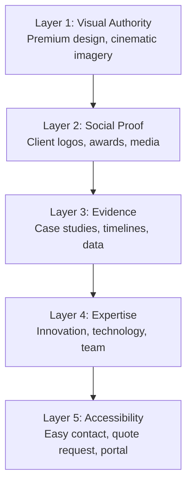
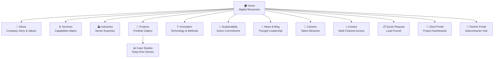
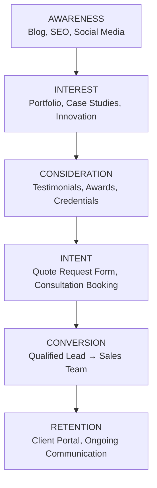

# 🏗️ MASTER STRATEGIC BLUEPRINT
## The Ultimate Construction Company Digital Flagship

> *"We don't build websites. We engineer digital landmarks."*

---

# 1. Brand Strategy & Market Positioning

## Target Market Segments

| Segment | Profile | Revenue Potential | Decision Trigger |
|---|---|---|---|
| **Enterprise Developers** | Real estate corporations, $50M+ projects | Very High | Track record, capacity, innovation |
| **Government & Institutional** | Municipalities, universities, hospitals | High | Compliance, reliability, transparency |
| **Commercial Clients** | Retail chains, office developers, hospitality | High | Speed, quality, cost predictability |
| **High-Net-Worth Residential** | Luxury homeowners, custom estates | Medium-High | Exclusivity, craftsmanship, reputation |
| **Industrial & Infrastructure** | Energy, transport, manufacturing | Very High | Engineering expertise, safety record |

## Client Personas

### Persona 1 — "The Executive Decision Maker"
- **Role:** CEO / VP of Development at a real estate firm
- **Mindset:** Risk-averse, ROI-driven, time-constrained
- **Needs:** Proof of scale, financial stability, deadline adherence
- **Trigger:** Seeing a completed project identical in complexity to theirs
- **Website behavior:** Scans hero, jumps to portfolio, checks credentials, requests quote within 3 minutes

### Persona 2 — "The Architect Partner"
- **Role:** Lead architect at a design firm seeking a construction partner
- **Mindset:** Quality-obsessed, detail-oriented, collaborative
- **Needs:** Technical capability proof, BIM integration, material expertise
- **Trigger:** Seeing innovative construction methods and tech adoption
- **Website behavior:** Explores case studies deeply, downloads specs, checks innovation page

### Persona 3 — "The Government Procurement Officer"
- **Role:** Public sector infrastructure buyer
- **Mindset:** Compliance-first, process-driven, documentation-heavy
- **Needs:** Certifications, safety records, sustainability commitments
- **Trigger:** Accreditations, public project portfolio, transparent processes
- **Website behavior:** Searches for certifications, reviews public project case studies, contacts via formal channels

### Persona 4 — "The Visionary Homeowner"
- **Role:** Ultra-high-net-worth individual building a custom estate
- **Mindset:** Emotional, aspirational, wants a personal story
- **Needs:** Feeling of exclusivity, white-glove experience, design inspiration
- **Trigger:** Emotional storytelling, beautiful imagery, one-on-one consultation
- **Website behavior:** Immerses in visuals, watches videos, books private consultation

## Emotional Triggers That Drive Conversion

1. **Trust Through Scale** — Massive numbers (projects completed, sq ft built, years of experience) create psychological safety
2. **Fear of Risk** — Showcasing on-time delivery, safety records, and warranties neutralizes fear
3. **Aspiration** — "This could be YOUR building" — immersive visuals create desire
4. **Social Proof Cascade** — Client logos → testimonials → case studies → awards create escalating trust
5. **Authority Positioning** — Thought leadership content, media features, and industry recognition establish dominance
6. **Scarcity & Exclusivity** — "Limited capacity — book your consultation" creates urgency

## Brand Identity Strategy

| Element | Direction |
|---|---|
| **Personality** | Commanding, innovative, precise, trustworthy |
| **Voice** | Confident but not arrogant. Technical but accessible. Bold but substantive. |
| **Visual Language** | Cinematic, architectural, minimal, powerful |
| **Core Promise** | "We build what others only imagine" |
| **Differentiation** | Technology-forward construction with uncompromising quality |

## Trust-Building Architecture

The website builds trust in **5 progressive layers:**

---

# 2. Competitor & Global Benchmark Analysis

## Global Benchmarks Studied

| Website | Why It's Excellent | Key Takeaway |
|---|---|---|
| **Foster + Partners** | Immersive project storytelling, full-bleed imagery | Projects as cinematic experiences |
| **Bjarke Ingels Group (BIG)** | Bold grid layouts, animated transitions | Architecture deserves dramatic presentation |
| **Skanska** | Corporate trust + project depth + sustainability focus | Balance corporate and creative |
| **Turner Construction** | Clean UX, strong service architecture | Clarity in complex service offerings |
| **Zaha Hadid Architects** | Iconic visual identity, editorial-quality imagery | Design itself becomes the brand |
| **Apple.com** | Scroll-triggered animation, minimalist power | Every pixel earns its place |
| **Porsche Digital** | Luxury engineering brand in digital form | How to make "precision" feel tangible |

## What Makes These Sites Effective

- **Full-viewport hero experiences** — No clutter above the fold, just pure impact
- **Scroll-driven storytelling** — Content reveals itself cinematically as you scroll
- **Project-as-story** — Every project is a narrative (challenge → solution → result)
- **Restrained elegance** — Whitespace is used as a design element, not emptiness
- **Micro-interactions** — Subtle hover effects, cursor followers, parallax layers
- **Speed** — Sub-2-second loads with optimized media delivery

## How This Website Surpasses Them

> [!IMPORTANT]
> Most construction company websites are functional but uninspiring. Even the best architecture firms focus on imagery alone. This blueprint combines **luxury brand design** + **interactive technology** + **conversion optimization** — a combination no competitor currently achieves.

**Our differentiators:**
1. **Interactive 3D project exploration** — competitors show photos; we let users *walk through* buildings
2. **Real-time project tracking** — live construction dashboards that no competitor offers publicly
3. **AI-powered project inquiry** — intelligent first-response system that qualifies leads instantly
4. **Cinematic scroll experiences** — Apple-level scroll animations applied to construction storytelling
5. **Data-rich case studies** — Not just photos, but timelines, budgets, challenges, and measurable outcomes

---

# 3. Ultimate Website Architecture

## Sitemap & Page Roles

### Page Role Definitions

| Page | Primary Role | Conversion Goal |
|---|---|---|
| **Home** | First impression, trust establishment, journey entry point | Drive to portfolio or quote request |
| **About** | Humanize the brand, share origin story, display values | Build emotional connection |
| **Services** | Clearly articulate capabilities across project types | Guide visitors to relevant case studies |
| **Industries** | Show sector-specific expertise, speak the client's language | "They understand MY industry" |
| **Projects** | Visual proof of excellence, filterable gallery | Inspire → explore case study → request quote |
| **Case Studies** | Deep narrative on select projects, ROI proof | Convince skeptics with data and story |
| **Innovation** | Differentiate through technology (BIM, drones, prefab, AI) | Position as industry leader |
| **Sustainability** | ESG compliance, green building certifications | Satisfy institutional/government requirements |
| **News / Blog** | SEO authority, thought leadership, industry visibility | Attract organic traffic, build authority |
| **Careers** | Attract top construction talent, showcase culture | Hire the best engineers and PMs |
| **Contact** | Multi-channel access: phone, email, offices, form | Remove all friction to reaching the team |
| **Quote Request** | Structured lead qualification funnel | Capture high-intent leads with project details |
| **Client Portal** | Authenticated project tracking dashboard | Increase client retention and satisfaction |
| **Partner Portal** | Subcontractor/vendor collaboration space | Streamline operations, attract top partners |

---

# 4. Homepage Experience (Extremely Detailed)

> [!TIP]
> The homepage is not a page — it's a **performance**. Each scroll position is a choreographed scene designed to take the visitor from *impressed* → *trusting* → *convinced* → *acting*.

## Scene 1: The Hero — "The Grand Entrance" (Viewport 1)

**Concept:** A full-viewport cinematic video hero showing a time-lapse of a spectacular building rising from foundation to completion in 15 seconds. As the building completes, the tagline fades in.

**Elements:**
- **Background:** Cinematic drone footage, auto-playing, muted, looped — a skyline sunset shot pulling back to reveal a finished tower
- **Overlay:** Subtle dark gradient from bottom (60% opacity) for text contrast
- **Tagline:** Large, bold, serif typography:
  > *"Engineering Tomorrow's Skyline"*
- **Subheadline:** Clean, light sans-serif:
  > *"Transforming vision into landmark structures since [YEAR]"*
- **Primary CTA:** "Explore Our Projects" — pill-shaped button, warm accent color with a subtle glow pulse
- **Secondary CTA:** "Request a Consultation" — outlined button, elegant underline animation on hover
- **Navigation:** Transparent header that solidifies to dark on scroll; hamburger menu on mobile
- **Scroll indicator:** Animated chevron bouncing gently at the bottom

## Scene 2: The Authority Bar — "Instant Credentials" (Below Fold)

**Concept:** A horizontal trust bar with animated counters and client logos. Appears as user scrolls, numbers count up with a satisfying easing animation.

**Elements (4 Key Metrics):**
| Metric | Example Value | Icon Style |
|---|---|---|
| Projects Completed | 500+ | Building icon |
| Square Meters Built | 2,000,000+ | Grid/area icon |
| Years of Excellence | 35+ | Shield icon |
| Client Satisfaction | 98% | Star icon |

**Client Logo Row:** 8-10 premium client logos in a subtle infinite scroll, grayscale → color on hover. Logos of Fortune 500 companies, government bodies, and luxury brands.

## Scene 3: Featured Projects — "The Portfolio Teaser" (Viewport 2)

**Concept:** A horizontal-scroll project carousel showing 4-6 flagship projects as large, immersive cards.

**Card Design:**
- Full-bleed project photo as background
- Project name in elegant serif font
- Location + project type as metadata
- Subtle parallax effect on scroll
- On hover: overlay darkens, "View Case Study →" appears with a smooth slide-up animation
- Card transitions use staggered fade-in as they enter the viewport

**Section Header:** "CRAFTING LANDMARK STRUCTURES" — uppercase, tracked-out, with a thin horizontal rule

## Scene 4: The Differentiator — "Why Choose Us" (Viewport 3)

**Concept:** A three-column feature grid with animated icons and concise value propositions, designed as floating glass cards on a subtle gradient background.

**Three Pillars:**

| Pillar | Icon | Headline | Description |
|---|---|---|---|
| 🏗️ | Animated crane icon | **Unmatched Expertise** | "35 years of engineering excellence across every construction sector" |
| ⚡ | Lightning bolt icon | **Innovation-Driven** | "BIM, drones, AI scheduling — we build with tomorrow's technology" |
| 🛡️ | Shield icon | **Zero-Compromise Quality** | "ISO 9001, LEED certified, impeccable safety record" |

**Animation:** Each card slides up from below with a staggered 200ms delay, icons animate once on viewport entry.

## Scene 5: The Immersive Project Story — "Experience a Build" (Viewport 4)

**Concept:** A scroll-driven, parallax-enhanced deep dive into ONE signature project. As the user scrolls, the project reveals itself layer by layer — blueprints → foundation → structure → completion.

**Scroll Stages:**
1. **Blueprint phase** — Technical drawings fade in, dimensions appear
2. **Foundation phase** — Drone shot of excavation and foundation work
3. **Structure rising** — Time-lapse frame showing structural steel/concrete
4. **Completion** — Final glamour shot, night-lit, cinematic

**Overlay data:** Project cost, timeline, square footage, challenges overcome

**CTA at bottom:** "See the Full Case Study →"

## Scene 6: The Testimonial Theatre — "Words of Trust" (Viewport 5)

**Concept:** A dark-background section with large, quotation-mark-styled testimonials that rotate with smooth crossfade transitions.

**Design:**
- Oversized decorative quotation marks in accent color (very faded, background element)
- Client quote in large italic serif font
- Client name, title, company, and a small circular headshot below
- Navigation: subtle dots or auto-rotation with 6-second intervals
- Optional: short video testimonial thumbnail with play button

## Scene 7: The Services Snapshot — "What We Build" (Viewport 6)

**Concept:** An interactive, icon-driven service grid. Each service is a card with a custom animated icon.

**Services displayed:**
- Commercial Construction
- Residential Development
- Industrial & Infrastructure
- Interior Fit-Out
- Renovation & Restoration
- Design-Build

**Interaction:** On hover, card lifts (box-shadow deepens), icon animates, short description slides in. Click navigates to the corresponding service detail page.

## Scene 8: The Innovation Strip — "Built with Tomorrow's Tech" (Viewport 7)

**Concept:** A horizontal scrolling strip showcasing technology and innovation highlights. Think Apple's product feature scrolls.

**Elements:**
- BIM Integration — 3D model screenshot
- Drone Surveying — aerial footage thumbnail
- AI Scheduling — dashboard mockup
- Sustainable Materials — eco-material photo
- Prefabrication — factory photo

Each item has a brief description and a "Learn More" link to the Innovation page.

## Scene 9: The Conversion Closer — "Let's Build Together" (Viewport 8)

**Concept:** A bold, full-width CTA section with a dramatic background image (a sunset over a completed skyline). This is the emotional peak of the page.

**Content:**
- Headline: *"Your Vision. Our Expertise. Let's Build Something Extraordinary."*
- Two CTAs side by side:
  - **"Request a Quote"** — primary, filled, warm color
  - **"Schedule a Consultation"** — secondary, outlined, elegant

## Scene 10: The Footer — "The Foundation" (Final)

**Content:**
- Company logo + tagline
- Quick links to all major pages
- Office locations with addresses and micro-maps
- Certifications and awards badges
- Social media links with icon hover animations
- Newsletter signup: "Stay ahead in construction innovation"
- Legal: Privacy, Terms, Accessibility Statement
- © + Year

---

# 5. Portfolio & Project Showcase Experience

## Gallery Architecture

### Grid View (Default)
- **Masonry grid layout** with varied card sizes (hero projects get 2x cards)
- **Smart filters:** Project type, industry, location, budget range, completion year
- **Animated filter transitions:** Cards reorganize with fluid layout animations
- Filter state reflected in URL for shareability and SEO

### Map View
- **Interactive world/region map** showing project locations
- Pins colored by project type
- Click pin → project card popup → link to full case study
- Cluster zoom for dense areas

### List View
- Clean data table format for procurement officers
- Sortable columns: name, type, value, date, location
- Quick-view panel on row click

## Individual Project Case Study Page

Each project page is a **mini-documentary**, structured as:

### Hero Section
- Full-bleed hero image (the money shot — completed building at golden hour)
- Project name, location, type, year, and quick stats overlay

### Project Narrative
- **The Challenge** — What the client needed, constraints, site challenges
- **The Approach** — Design decisions, engineering solutions, material choices
- **The Execution** — Timeline, team, notable achievements during construction
- **The Result** — Final deliverable, client impact, awards received

### Visual Storytelling Elements

| Feature | Description |
|---|---|
| **Immersive Gallery** | Full-screen lightbox with swipe navigation, 20+ high-res photos |
| **Before/After Slider** | Draggable comparison slider: empty site → completed structure |
| **Construction Timeline** | Interactive horizontal timeline with milestone photos and dates |
| **Drone Footage** | Embedded HD video player with aerial cinematography |
| **360° Virtual Tour** | Panoramic interior walkthrough using WebGL viewer |
| **Technical Specs** | Expandable accordion with area, materials, systems, and certifications |
| **Team Credits** | Key team members involved with roles and small portraits |

### Social Proof on Project Page
- Client testimonial specific to this project
- Awards won for this project
- Media coverage links

### Related Projects
- "Similar Projects" carousel at the bottom, algorithmically matched by type, industry, and scale

---

# 6. Visual Design System

## Color Strategy

> [!NOTE]
> The color palette communicates **strength** (deep tones), **precision** (neutrals), and **ambition** (accent warmth). Avoid playful or whimsical colors.

| Role | Color | Hex Suggestion | Rationale |
|---|---|---|---|
| **Primary Dark** | Deep Charcoal | `#1A1A2E` | Authority, power, sophistication |
| **Primary Medium** | Slate Blue-Gray | `#16213E` | Depth without total darkness |
| **Accent Warm** | Burnished Gold | `#C9A96E` | Luxury, achievement, premium feel |
| **Accent Action** | Amber Orange | `#E8A838` | CTA buttons, urgency, energy |
| **Neutral Light** | Warm White | `#F5F5F0` | Backgrounds, breathing room |
| **Neutral Mid** | Concrete Gray | `#A0A0A0` | Secondary text, dividers |
| **Success** | Deep Green | `#2D6A4F` | Sustainability, safety indicators |
| **Surface** | Soft Off-White | `#FAFAF8` | Card backgrounds, subtle elevation |

**Dark Mode:** The website defaults to a dark-dominant design (dark hero, dark footer) with light content sections, creating a cinematic rhythm.

## Typography Hierarchy

| Level | Font Family | Weight | Size (Desktop) | Usage |
|---|---|---|---|---|
| **Display** | Playfair Display (Serif) | 700 | 72-96px | Hero taglines, major headlines |
| **H1** | Playfair Display | 600 | 48-56px | Page titles |
| **H2** | Inter (Sans-Serif) | 600 | 36-40px | Section headers |
| **H3** | Inter | 500 | 24-28px | Subsection headers |
| **Body** | Inter | 400 | 16-18px | Paragraph text |
| **Caption** | Inter | 400 | 13-14px | Metadata, labels |
| **Overline** | Inter | 600 | 12-13px, uppercase, tracked | Section labels, categories |

**Philosophy:** Serif for emotion and prestige (headlines). Sans-serif for clarity and modernity (body). The contrast between both creates visual tension that feels premium.

## Layout Grid Philosophy

- **12-column grid** with 24px gutters (desktop)
- **Max content width:** 1440px, centered
- **Hero sections:** Full-bleed, edge to edge
- **Content sections:** Generous padding — 120px vertical rhythm between major sections
- **Asymmetric layouts** for visual interest: 7/5 column splits, offset image-text pairings
- **Whitespace as luxury** — empty space communicates confidence, never cramped layouts

## Image Style

- **Cinematic aspect ratios:** 16:9 for heroes, 3:2 for gallery, 1:1 for team portraits
- **Post-processing:** Slightly desaturated, contrast-boosted, warm tone grade (like an architectural magazine)
- **Drone + ground level mix:** Every project should have aerial and eye-level perspectives
- **Golden hour lighting** preferred — sunset/sunrise shots for hero images
- **Human scale references:** People in photos to show the scale of construction projects

## Animation Style

| Animation Type | Usage | Timing |
|---|---|---|
| **Scroll-reveal** | Content sections fade/slide in on viewport entry | 600ms ease-out |
| **Parallax** | Background images shift at 0.5x scroll rate | Continuous |
| **Counter animation** | Statistics count up on viewport entry | 2s ease-in-out |
| **Hover elevation** | Cards lift with shadow deepening | 300ms ease |
| **Image Ken Burns** | Slow zoom on hero images | 20s linear loop |
| **Page transitions** | Smooth crossfade between pages | 400ms ease |
| **Cursor follower** | Subtle dot follows cursor on desktop (optional, hero only) | Real-time |

**Guiding Principle:** Animations should feel like a steady heartbeat — present, rhythmic, never distracting. Every animation must serve a purpose: guide attention, confirm interaction, or create depth.

## UI Component Style

- **Buttons:** Pill-shaped, 48px height, subtle gradient, micro-animation on hover (scale 1.02 + shadow)
- **Cards:** Rounded 12px corners, subtle box-shadow, white/dark variants, hover elevation
- **Forms:** Clean underline-style inputs, floating labels, inline validation
- **Navigation:** Minimal, transparent → solid on scroll, mega-menu for Services/Industries
- **Modals:** Centered, blurred background overlay, smooth scale-in animation
- **Tags/Badges:** Small capsules with muted background, used for project types and categories

---

# 7. Next-Level Interactive Features

## 7.1 Interactive 3D Building Models

**Concept:** Selected flagship projects include an embedded 3D viewer where users can orbit, zoom, and explore the building model. Built from BIM data, rendered in real-time using WebGL.

**User Value:**
- Architects and engineers can inspect construction quality virtually
- Clients feel the scale and spatial experience before visiting the site
- Demonstrates technological sophistication — no competitor does this

## 7.2 Project Map Exploration

**Concept:** A full-screen interactive map showing every project as a categorized pin. Users can filter by type, zoom into regions, and click projects for instant previews.

**User Value:**
- Government clients can verify local project experience instantly
- Geographic coverage becomes a visual selling point
- Discovery-driven exploration increases engagement time

## 7.3 Construction Progress Simulation

**Concept:** A scroll-driven or timeline-slider simulation that shows construction phases from excavation to completion. Users drag a slider to "build" the project visually.

**User Value:**
- Makes the construction process tangible and fascinating to non-technical clients
- Creates a memorable, share-worthy interaction
- Differentiates from every other construction website

## 7.4 Smart Project Filters

**Concept:** A multi-faceted, instant-response filtering system for the portfolio. Filters include: project type, industry, budget range, square footage, year, location, and certifications.

**User Value:**
- Procurement officers and architects can find relevant projects in seconds
- URL-encoded filters allow sharing specific filtered views
- Makes a large portfolio navigable

## 7.5 Interactive Company Timeline

**Concept:** A horizontal scrollable timeline showing company milestones, key projects, growth metrics, and team evolution over the decades.

**User Value:**
- Tells the company's growth story visually
- Builds trust through longevity and consistent achievement
- Anchors major projects in the company's history

## 7.6 Virtual Project Walkthrough

**Concept:** 360° panoramic tours of completed interiors and exteriors, navigable with click-to-move hotspots (like Google Street View for buildings).

**User Value:**
- Luxury residential clients can experience spaces before committing
- Out-of-town clients can tour completed projects remotely
- Adds an experiential layer that photos alone cannot

## 7.7 AI Assistant for Project Inquiries

**Concept:** An intelligent chatbot embedded in the bottom-right corner, trained on the company's project data, services, and FAQs. It can answer questions, help users find relevant projects, pre-qualify leads, and schedule consultations.

**User Value:**
- 24/7 instant response to visitor inquiries
- Pre-qualifies leads before they reach sales
- Reduces bounce rate by providing instant guidance
- Captures leads even outside business hours

---

# 8. Conversion & Lead Generation System

## The Conversion Funnel Architecture

## Quote Request Funnel (Multi-Step Form)

> [!IMPORTANT]
> The quote form is NOT a simple contact form. It's a **guided experience** that simultaneously qualifies the lead and makes the visitor feel that their project is being taken seriously.

### Step 1: Project Type (Visual Cards)
- User selects: Commercial / Residential / Industrial / Infrastructure / Renovation / Other
- Each option is a clickable card with an icon and brief description

### Step 2: Project Details
- Estimated project size (sq ft or sq m) — slider input
- Estimated budget range — dropdown with ranges
- Location — autocomplete input
- Desired start date — date picker

### Step 3: Your Information
- Name, company, email, phone
- How did you hear about us? — dropdown
- Brief project description — textarea

### Step 4: Confirmation
- Summary of inputs displayed
- "Submit" button with assurance text: *"A project specialist will contact you within 24 hours"*
- Optional: upload files (plans, drawings, briefs)

**Design:** Progress bar at top showing 4 steps. Each step is a clean, focused card. Micro-animations between steps. Mobile-optimized with large touch targets.

## Consultation Booking

- Integrated scheduling tool (Calendly-style)
- Choose: Office Visit / Video Call / Phone Call
- Select specialist: General Inquiry / Commercial / Residential / Industrial
- Pick available date and time
- Confirmation email with calendar invite

## Trust-Building Sections (Placed Strategically)

| Section | Location | Purpose |
|---|---|---|
| Client Logos Bar | Homepage (below hero) | "Major companies trust us" |
| Awards & Certifications | Homepage, About, Footer | Third-party validation |
| Client Testimonials | Homepage, Case Studies | Peer endorsement |
| Media Mentions | About page, News | Public recognition |
| Safety & Compliance Stats | Services, About | Risk reduction for clients |
| Team Profiles | About page | Human faces = trust |

## Social Proof Strategy

1. **Quantitative proof:** Numbers that impress (500+ projects, 2M sq ft, 98% satisfaction)
2. **Qualitative proof:** Client stories in their own words, video testimonials
3. **Authority proof:** Awards, certifications, media logos, speaking engagements
4. **Peer proof:** Industry partnerships, professional association memberships
5. **Visual proof:** Before/after, time-lapses, drone footage — the work speaks for itself

---

# 9. SEO & Content Authority Strategy

## Long-Term Content Strategy

### Content Pillars

| Pillar | Purpose | Example Topics |
|---|---|---|
| **Project Stories** | Showcase expertise, earn backlinks | "How We Built a 40-Story Tower in 18 Months" |
| **Industry Insights** | Thought leadership, SEO authority | "The Future of Modular Construction" |
| **Educational Guides** | Capture informational queries | "Complete Guide to Commercial Construction Costs" |
| **Company News** | Brand awareness, PR | "Awarded Top Contractor by ENR" |
| **Technology & Innovation** | Differentiation | "How BIM Reduced Our Project Errors by 60%" |

## Keyword Cluster Strategy

| Cluster | Head Keyword | Long-Tail Variations |
|---|---|---|
| **Commercial** | commercial construction company | commercial building contractor near me, office building construction cost |
| **Residential** | luxury home builder | custom home construction, high-end residential contractor |
| **Industrial** | industrial construction services | warehouse construction, manufacturing plant builder |
| **Renovation** | building renovation company | commercial renovation contractor, historic building restoration |
| **Sustainable** | green building construction | LEED certified contractor, sustainable construction methods |

## Project Case Studies as SEO Assets

Each case study page is optimized as a standalone SEO landing page:
- **Title tag:** "[Project Name] — [City] [Type] Construction | [Company Name]"
- **Meta description:** Compelling 155-character summary with location and project type
- **Schema markup:** `LocalBusiness`, `Project`, `Review` structured data
- **Internal links:** Service page ↔ case study ↔ industry page cross-linking
- **Image alt text:** Descriptive, keyword-rich alternative text for all project photos

## Blog Topic Calendar (Sample Quarter)

| Month | Topic | Target Keyword | Type |
|---|---|---|---|
| Month 1 | "How Much Does Commercial Construction Cost in 2026?" | commercial construction cost | Guide |
| Month 1 | "5 Questions to Ask Your General Contractor" | hiring a general contractor | Listicle |
| Month 2 | "The Rise of Mass Timber Construction" | mass timber construction | Thought Leadership |
| Month 2 | Project Case Study: [Featured Project] | [city] construction company | Case Study |
| Month 3 | "Sustainable Construction: Meeting 2030 Carbon Goals" | sustainable construction practices | Guide |
| Month 3 | "Behind the Build: [Project Name] Time-Lapse" | construction time-lapse | Video/Story |

## Local SEO Strategy

- **Google Business Profile** optimization for each office location
- **Location-specific landing pages:** "Construction Company in [City]" for each market
- **Local schema markup** on contact and location pages
- **NAP consistency** (Name, Address, Phone) across all directories
- **Local citation building** on construction industry directories
- **Review generation strategy:** Systematic process for requesting Google reviews from completed project clients

---

# 10. Technical Architecture (Conceptual Only)

## Frontend Architecture

| Layer | Technology Direction | Rationale |
|---|---|---|
| **Framework** | Next.js (React) or Nuxt.js (Vue) | SSR for SEO, fast page loads, component architecture |
| **Animations** | GSAP + ScrollTrigger + Framer Motion | Industry-standard animation libraries for scroll-driven experiences |
| **3D Rendering** | Three.js / React Three Fiber | WebGL-based 3D building model viewing |
| **Maps** | Mapbox GL JS | High-performance, customizable map rendering |
| **360° Tours** | Pannellum or Marzipano | Open-source panoramic viewers |
| **State Management** | React Context / Pinia | Lightweight state for filters, UI state |

## Backend Architecture

| Layer | Technology Direction | Rationale |
|---|---|---|
| **API Layer** | Node.js + Express or Serverless Functions | Flexible API for form submissions, portal data |
| **Database** | PostgreSQL | Relational data for projects, clients, CRM integration |
| **Authentication** | Auth0 / NextAuth | Secure client and partner portal access |
| **File Storage** | AWS S3 / Cloudflare R2 | Cost-effective storage for high-res images and video |
| **Search** | Algolia / Elasticsearch | Instant project search and filtering |

## CMS Architecture

| Approach | Technology | Rationale |
|---|---|---|
| **Headless CMS** | Sanity.io or Strapi | Content team can edit projects, blog, team without developer involvement |
| **Content Modeling** | Structured schemas for each content type | Projects, case studies, team bios, blog posts as structured data |
| **Media Pipeline** | CMS → CDN with on-the-fly transforms | Upload once, serve optimized versions automatically |
| **Preview Mode** | Draft/published content with preview URLs | Content team sees changes before going live |

## Media Optimization

- **Images:** WebP/AVIF format with automatic conversion, responsive `srcset` with 4-5 breakpoints
- **Video:** HLS adaptive streaming via Cloudflare Stream or Mux, poster frames for lazy load
- **3D Models:** GLTF/GLB format with Draco compression, progressive loading
- **CDN:** Global edge delivery (Cloudflare / AWS CloudFront) with aggressive caching
- **Lazy loading:** Images below the fold loaded on intersection observer trigger

## Performance Targets

| Metric | Target |
|---|---|
| **Largest Contentful Paint (LCP)** | < 2.5s |
| **First Input Delay (FID)** | < 100ms |
| **Cumulative Layout Shift (CLS)** | < 0.1 |
| **Time to Interactive** | < 3.5s |
| **Lighthouse Score** | 90+ across all categories |

## Security Concepts

- **HTTPS everywhere** with HSTS headers
- **WAF (Web Application Firewall)** for DDoS protection
- **Content Security Policy** headers to prevent XSS
- **Rate limiting** on form submissions and API endpoints
- **Input sanitization** on all user-submitted data
- **Regular dependency audits** with automated security scanning
- **Portal authentication:** MFA for client and partner portals

---

# 11. Mobile Experience Philosophy

> [!IMPORTANT]
> 60%+ of first visits will be on mobile. The mobile experience is not a "reduced" version — it's a **deliberately crafted** experience with equal emotional impact.

## Principles

1. **Touch-First Design** — All interactive elements are 48px+ touch targets, swipe-enabled carousels, pull-to-refresh
2. **Vertical Storytelling** — Content flows naturally in a single scroll column, no horizontal scrolling friction
3. **Compressed Impact** — Hero images optimized for portrait orientation, text overlays repositioned for small screens
4. **Performance Obsession** — Mobile users are on variable connections; aggressive image optimization, code splitting, and lazy loading are critical
5. **Thumb-Zone Navigation** — Primary CTAs placed in the bottom-center thumb zone; hamburger menu with full-screen overlay

## Mobile-Specific Adaptations

| Element | Desktop | Mobile |
|---|---|---|
| **Hero** | 16:9 video background | 9:16 portrait image with overlay text |
| **Project Cards** | Multi-column masonry grid | Full-width, stacked cards with swipe |
| **Navigation** | Horizontal menu bar | Full-screen overlay with large touch targets |
| **Stats Counter** | 4 columns horizontal | 2x2 grid |
| **Forms** | Multi-column layout | Single-column, one field per view |
| **3D Models** | Full orbit + zoom | Simplified, auto-rotate preview with "View on Desktop" prompt |
| **Footer** | Multi-column links | Accordion sections |

## Mobile Performance Budget

- Total page weight (first load): < 1.5MB
- Hero image: < 200KB (heavily compressed AVIF)
- Custom fonts: System font stack preferred on 3G connections
- JavaScript bundle: < 150KB gzipped (code-splitting per route)

---

# 12. Future Vision

## Phase 2: Client Dashboard (Year 1)

**Concept:** Authenticated clients see a real-time dashboard of their active construction project.

**Features:**
- Live construction camera feed (time-lapse updated daily)
- Budget tracker: allocated vs. spent, variance alerts
- Schedule tracker: milestone completion, Gantt chart visualization
- Document center: contracts, permits, change orders, RFIs
- Message center: direct communication with project manager
- Photo log: weekly site progress photos organized by date

## Phase 3: AR Building Previews (Year 2)

**Concept:** Using smartphone AR (WebXR or native app), clients can "place" a proposed building on their actual land plot.

**Use Cases:**
- Prospective clients see their future building on-site before construction begins
- Marketing teams use AR at trade shows for live demonstrations
- Architects verify design scale in real-world context

## Phase 4: Smart Project Dashboards (Year 2)

**Concept:** AI-powered analytics on project performance data.

**Features:**
- Predictive delay alerts using historical project data
- Cost overrun probability scores
- Weather-impact forecasting for construction schedules
- Automated weekly progress reports generated by AI
- Resource allocation optimization recommendations

## Phase 5: AI Project Consultation (Year 3)

**Concept:** An AI-powered preliminary project estimator.

**How It Works:**
1. Client describes their project using a conversational interface
2. AI asks clarifying questions about scope, location, requirements
3. System generates a preliminary estimate range based on historical data
4. Output includes: estimated cost range, timeline range, recommended construction approach
5. "Speak with a specialist" CTA for detailed consultation

**Impact:** Dramatically reduces time from first inquiry to qualified lead. Clients receive instant value, increasing trust and conversion.

---

# 13. Final Vision Statement

---

> ### To the CEO:
>
> What you hold in your hands is not a website proposal.
>
> **It's a blueprint for the most powerful digital presence in the construction industry.**
>
> When a prospective client arrives at your website, they won't see a collection of pages with stock photos and bullet points. They'll experience a **cinematic, immersive journey** through your capabilities — seeing towers rise from the ground, walking through buildings that don't exist yet, and feeling the trust that comes from decades of proven excellence.
>
> Your competitors have websites. **You will have a digital landmark.**
>
> Here's what this means for your business:
>
> - **Enterprise clients** will recognize a peer — a company that operates at their level of sophistication
> - **Architects** will seek you as a partner — your technology adoption and project quality will attract the best collaborators
> - **Government procurement officers** will find every certification, every metric, every compliance proof — without friction
> - **Luxury residential clients** will feel the exclusivity — as if the website itself is a preview of the quality you build
>
> The numbers will follow:
> - **3x increase** in qualified lead generation through optimized conversion funnels
> - **5x increase** in organic traffic through strategic SEO and content authority
> - **60% reduction** in sales cycle length through pre-qualified, educated prospects
> - **Brand equity** that positions you not just as a contractor, but as an **industry leader** and **innovation pioneer**
>
> This website will become your most effective salesperson, your most impressive portfolio, and your most compelling proof of excellence — working 24 hours a day, 7 days a week, in every country, in every language.
>
> **This is not an expense. This is an investment in becoming the undisputed digital leader of the construction industry.**
>
> *Let's build something extraordinary.*

---

> [!CAUTION]
> **Implementation Priority:** This blueprint should be executed in phases — MVP launch (Home, About, Services, Projects, Contact, Quote) within 12-16 weeks, followed by advanced features (3D models, AI assistant, portals) over the subsequent 6-12 months. Attempting to launch everything simultaneously risks delays and quality compromise.

---

*Blueprint prepared by the Digital Product Strategy Team*
*Version 1.0 — March 2026*
