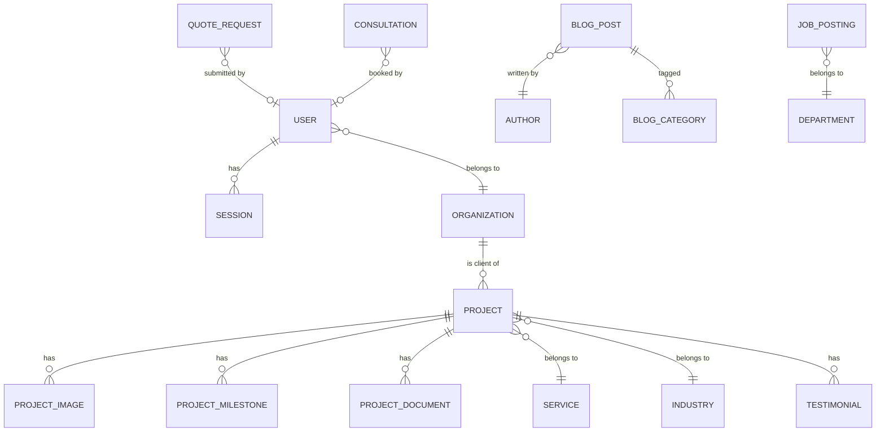
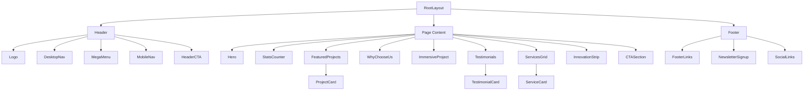
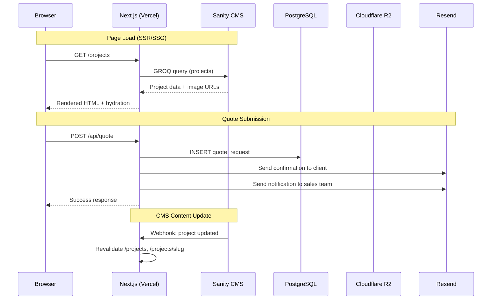
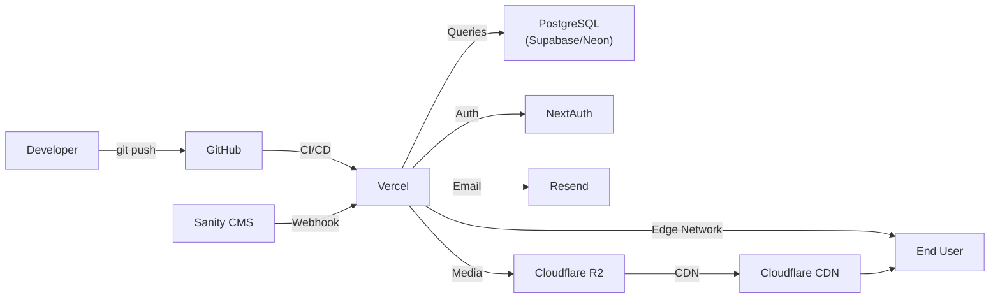
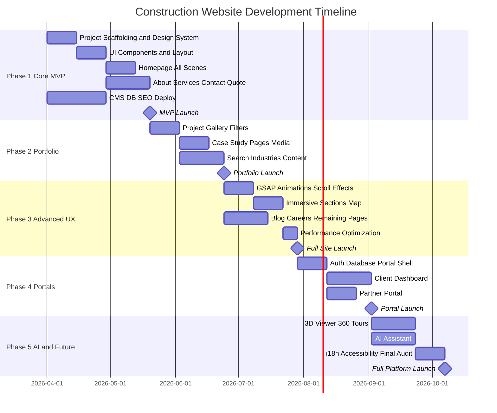

# 🏗️ TECHNICAL EXECUTION ROADMAP
## Construction Company Flagship Website — Developer Implementation Guide

> *This document translates the Master Strategic Blueprint into an actionable, phase-by-phase engineering plan.*

---

# 1. Technology Stack Selection

## Frontend

| Layer | Technology | Version | Rationale |
|---|---|---|---|
| **Framework** | Next.js (App Router) | 15.x | SSR/SSG for SEO, React Server Components, image optimization built-in |
| **Language** | TypeScript | 5.x | Type safety across components, API routes, and CMS types |
| **Styling** | Tailwind CSS + CSS Modules | 4.x | Utility-first for rapid development; CSS Modules for complex animations |
| **Animation** | GSAP + ScrollTrigger | 3.x | Industry-standard scroll-driven animation engine |
| **Motion** | Framer Motion | 11.x | React-native declarative animations for page transitions and micro-interactions |
| **3D** | Three.js + React Three Fiber | Latest | WebGL building model viewer |
| **Maps** | Mapbox GL JS | 3.x | Customizable, performant interactive maps |
| **360° Tours** | Pannellum | 2.x | Lightweight panoramic viewer |
| **Icons** | Lucide React | Latest | Consistent, tree-shakeable icon set |
| **Forms** | React Hook Form + Zod | Latest | Performant forms with schema validation |

## Backend & Infrastructure

| Layer | Technology | Rationale |
|---|---|---|
| **API** | Next.js API Routes + tRPC | Type-safe API layer co-located with frontend |
| **Database** | PostgreSQL 16 | Relational data, JSONB for flexible fields |
| **ORM** | Prisma | Type-safe DB queries, migrations, seeding |
| **Auth** | NextAuth.js v5 | Client/partner portal authentication |
| **File Storage** | Cloudflare R2 | S3-compatible, zero egress fees |
| **CDN/Edge** | Cloudflare | Global edge network, WAF, DDoS protection |
| **Email** | Resend | Transactional email (form confirmations, notifications) |
| **Search** | Meilisearch | Lightweight, self-hosted instant search |
| **Analytics** | Plausible | Privacy-friendly, lightweight analytics |

## CMS

| Layer | Technology | Rationale |
|---|---|---|
| **CMS** | Sanity.io | Real-time editing, structured content, image pipeline |
| **Studio** | Sanity Studio v3 | Custom editing UI embedded at `/admin` |
| **Media** | Sanity Image Pipeline | On-the-fly crops, formats (WebP/AVIF), responsive URLs |
| **Preview** | Next.js Draft Mode | Live preview of unpublished CMS content |

## DevOps

| Layer | Technology | Rationale |
|---|---|---|
| **Hosting** | Vercel | Native Next.js hosting, edge functions, preview deployments |
| **CI/CD** | GitHub Actions | Automated testing, linting, deployment on push |
| **Monitoring** | Sentry | Error tracking and performance monitoring |
| **Uptime** | BetterUptime | Status page and incident management |

---

# 2. Project & Folder Architecture

```
construction-website/
├── .github/
│   └── workflows/
│       ├── ci.yml                    # Lint + test on PR
│       ├── deploy-preview.yml        # Preview deployment
│       └── deploy-production.yml     # Production deployment
│
├── apps/
│   ├── web/                          # Next.js application
│   │   ├── public/
│   │   │   ├── fonts/                # Self-hosted font files
│   │   │   ├── icons/                # Favicons, app icons
│   │   │   └── og/                   # Open Graph images
│   │   │
│   │   ├── src/
│   │   │   ├── app/                  # Next.js App Router
│   │   │   │   ├── (marketing)/      # Public-facing route group
│   │   │   │   │   ├── page.tsx              # Homepage
│   │   │   │   │   ├── about/page.tsx
│   │   │   │   │   ├── services/
│   │   │   │   │   │   ├── page.tsx          # Services index
│   │   │   │   │   │   └── [slug]/page.tsx   # Individual service
│   │   │   │   │   ├── industries/
│   │   │   │   │   │   ├── page.tsx
│   │   │   │   │   │   └── [slug]/page.tsx
│   │   │   │   │   ├── projects/
│   │   │   │   │   │   ├── page.tsx          # Portfolio gallery
│   │   │   │   │   │   └── [slug]/page.tsx   # Case study page
│   │   │   │   │   ├── innovation/page.tsx
│   │   │   │   │   ├── sustainability/page.tsx
│   │   │   │   │   ├── blog/
│   │   │   │   │   │   ├── page.tsx          # Blog listing
│   │   │   │   │   │   └── [slug]/page.tsx   # Blog post
│   │   │   │   │   ├── careers/
│   │   │   │   │   │   ├── page.tsx
│   │   │   │   │   │   └── [slug]/page.tsx   # Job posting
│   │   │   │   │   ├── contact/page.tsx
│   │   │   │   │   └── quote/page.tsx        # Multi-step form
│   │   │   │   │
│   │   │   │   ├── (portal)/          # Authenticated route group
│   │   │   │   │   ├── layout.tsx            # Portal shell + auth guard
│   │   │   │   │   ├── client/
│   │   │   │   │   │   ├── page.tsx          # Client dashboard
│   │   │   │   │   │   ├── projects/[id]/    # Project tracker
│   │   │   │   │   │   └── documents/        # Document center
│   │   │   │   │   └── partner/
│   │   │   │   │       ├── page.tsx          # Partner dashboard
│   │   │   │   │       └── opportunities/    # Available projects
│   │   │   │   │
│   │   │   │   ├── api/               # API routes
│   │   │   │   │   ├── contact/route.ts
│   │   │   │   │   ├── quote/route.ts
│   │   │   │   │   ├── newsletter/route.ts
│   │   │   │   │   ├── search/route.ts
│   │   │   │   │   └── revalidate/route.ts   # CMS webhook
│   │   │   │   │
│   │   │   │   ├── layout.tsx         # Root layout
│   │   │   │   ├── not-found.tsx      # Custom 404
│   │   │   │   └── sitemap.ts         # Dynamic sitemap
│   │   │   │
│   │   │   ├── components/
│   │   │   │   ├── ui/                # Primitive UI components
│   │   │   │   │   ├── Button.tsx
│   │   │   │   │   ├── Card.tsx
│   │   │   │   │   ├── Badge.tsx
│   │   │   │   │   ├── Input.tsx
│   │   │   │   │   ├── Modal.tsx
│   │   │   │   │   ├── Accordion.tsx
│   │   │   │   │   ├── Tabs.tsx
│   │   │   │   │   ├── Carousel.tsx
│   │   │   │   │   └── Skeleton.tsx
│   │   │   │   │
│   │   │   │   ├── layout/            # Structural components
│   │   │   │   │   ├── Header.tsx
│   │   │   │   │   ├── Footer.tsx
│   │   │   │   │   ├── MegaMenu.tsx
│   │   │   │   │   ├── MobileNav.tsx
│   │   │   │   │   └── Section.tsx
│   │   │   │   │
│   │   │   │   ├── sections/          # Page-section components
│   │   │   │   │   ├── Hero.tsx
│   │   │   │   │   ├── StatsCounter.tsx
│   │   │   │   │   ├── FeaturedProjects.tsx
│   │   │   │   │   ├── WhyChooseUs.tsx
│   │   │   │   │   ├── ImmersiveProject.tsx
│   │   │   │   │   ├── Testimonials.tsx
│   │   │   │   │   ├── ServicesGrid.tsx
│   │   │   │   │   ├── InnovationStrip.tsx
│   │   │   │   │   ├── CTASection.tsx
│   │   │   │   │   └── NewsletterSignup.tsx
│   │   │   │   │
│   │   │   │   ├── projects/          # Project-related components
│   │   │   │   │   ├── ProjectCard.tsx
│   │   │   │   │   ├── ProjectGallery.tsx
│   │   │   │   │   ├── ProjectFilters.tsx
│   │   │   │   │   ├── ProjectMap.tsx
│   │   │   │   │   ├── ProjectTimeline.tsx
│   │   │   │   │   ├── BeforeAfterSlider.tsx
│   │   │   │   │   ├── ModelViewer.tsx
│   │   │   │   │   └── PanoramicTour.tsx
│   │   │   │   │
│   │   │   │   ├── forms/             # Form components
│   │   │   │   │   ├── QuoteForm.tsx
│   │   │   │   │   ├── ContactForm.tsx
│   │   │   │   │   └── ConsultationBooking.tsx
│   │   │   │   │
│   │   │   │   └── shared/            # Cross-cutting components
│   │   │   │       ├── AnimatedCounter.tsx
│   │   │   │       ├── ScrollReveal.tsx
│   │   │   │       ├── ParallaxImage.tsx
│   │   │   │       ├── VideoPlayer.tsx
│   │   │   │       └── ClientLogos.tsx
│   │   │   │
│   │   │   ├── hooks/                 # Custom React hooks
│   │   │   │   ├── useScrollProgress.ts
│   │   │   │   ├── useIntersection.ts
│   │   │   │   ├── useMediaQuery.ts
│   │   │   │   └── useAnimatedCounter.ts
│   │   │   │
│   │   │   ├── lib/                   # Utilities & config
│   │   │   │   ├── sanity/
│   │   │   │   │   ├── client.ts      # Sanity client config
│   │   │   │   │   ├── queries.ts     # GROQ queries
│   │   │   │   │   └── image.ts       # Image URL builder
│   │   │   │   ├── db.ts              # Prisma client
│   │   │   │   ├── auth.ts            # NextAuth config
│   │   │   │   ├── email.ts           # Resend config
│   │   │   │   ├── utils.ts           # General utilities
│   │   │   │   └── constants.ts       # Site-wide constants
│   │   │   │
│   │   │   ├── styles/
│   │   │   │   ├── globals.css        # Global styles, CSS variables
│   │   │   │   └── animations.css     # GSAP/custom animation classes
│   │   │   │
│   │   │   └── types/                 # TypeScript type definitions
│   │   │       ├── project.ts
│   │   │       ├── service.ts
│   │   │       ├── blog.ts
│   │   │       └── common.ts
│   │   │
│   │   ├── prisma/
│   │   │   ├── schema.prisma          # Database schema
│   │   │   ├── migrations/            # Database migrations
│   │   │   └── seed.ts                # Seed data
│   │   │
│   │   ├── next.config.ts
│   │   ├── tailwind.config.ts
│   │   ├── tsconfig.json
│   │   └── package.json
│   │
│   └── studio/                        # Sanity Studio
│       ├── schemas/                   # Content type schemas
│       │   ├── project.ts
│       │   ├── service.ts
│       │   ├── industry.ts
│       │   ├── blogPost.ts
│       │   ├── teamMember.ts
│       │   ├── testimonial.ts
│       │   ├── award.ts
│       │   ├── jobPosting.ts
│       │   └── siteSettings.ts
│       ├── sanity.config.ts
│       └── package.json
│
├── packages/                          # Shared packages (if monorepo)
│   └── shared/
│       ├── types/                     # Shared TypeScript types
│       └── utils/                     # Shared utility functions
│
├── turbo.json                         # Turborepo config (if monorepo)
├── package.json                       # Root package.json
└── README.md
```

---

# 3. Database Design

## Entity Relationship Diagram



## Core Tables

### `projects`
```sql
CREATE TABLE projects (
    id              UUID PRIMARY KEY DEFAULT gen_random_uuid(),
    slug            VARCHAR(255) UNIQUE NOT NULL,
    title           VARCHAR(255) NOT NULL,
    subtitle        VARCHAR(500),
    description     TEXT NOT NULL,
    
    -- Classification
    service_id      UUID REFERENCES services(id),
    industry_id     UUID REFERENCES industries(id),
    project_type    VARCHAR(50) NOT NULL,         -- commercial, residential, industrial, infrastructure
    
    -- Details
    location_city   VARCHAR(100),
    location_country VARCHAR(100),
    latitude        DECIMAL(10, 8),
    longitude       DECIMAL(11, 8),
    area_sqm        INTEGER,
    budget_range    VARCHAR(50),                   -- e.g., "$10M-$50M"
    year_completed  INTEGER,
    duration_months INTEGER,
    
    -- Story
    challenge       TEXT,
    approach        TEXT,
    execution       TEXT,
    result          TEXT,
    
    -- Media
    hero_image_url  VARCHAR(500),
    video_url       VARCHAR(500),
    model_3d_url    VARCHAR(500),
    tour_360_url    VARCHAR(500),
    
    -- SEO
    meta_title      VARCHAR(70),
    meta_description VARCHAR(160),
    
    -- Status
    is_featured     BOOLEAN DEFAULT false,
    is_published    BOOLEAN DEFAULT false,
    display_order   INTEGER DEFAULT 0,
    
    -- Timestamps
    created_at      TIMESTAMPTZ DEFAULT NOW(),
    updated_at      TIMESTAMPTZ DEFAULT NOW()
);
```

### `project_images`
```sql
CREATE TABLE project_images (
    id              UUID PRIMARY KEY DEFAULT gen_random_uuid(),
    project_id      UUID REFERENCES projects(id) ON DELETE CASCADE,
    url             VARCHAR(500) NOT NULL,
    alt_text        VARCHAR(255),
    caption         VARCHAR(500),
    image_type      VARCHAR(30),                   -- hero, gallery, before, after, aerial, interior
    display_order   INTEGER DEFAULT 0,
    width           INTEGER,
    height          INTEGER,
    created_at      TIMESTAMPTZ DEFAULT NOW()
);
```

### `project_milestones`
```sql
CREATE TABLE project_milestones (
    id              UUID PRIMARY KEY DEFAULT gen_random_uuid(),
    project_id      UUID REFERENCES projects(id) ON DELETE CASCADE,
    title           VARCHAR(255) NOT NULL,
    description     TEXT,
    milestone_date  DATE,
    image_url       VARCHAR(500),
    display_order   INTEGER DEFAULT 0
);
```

### `services`
```sql
CREATE TABLE services (
    id              UUID PRIMARY KEY DEFAULT gen_random_uuid(),
    slug            VARCHAR(255) UNIQUE NOT NULL,
    title           VARCHAR(255) NOT NULL,
    short_description VARCHAR(500),
    full_description TEXT,
    icon_name       VARCHAR(50),
    hero_image_url  VARCHAR(500),
    display_order   INTEGER DEFAULT 0,
    is_published    BOOLEAN DEFAULT true,
    meta_title      VARCHAR(70),
    meta_description VARCHAR(160),
    created_at      TIMESTAMPTZ DEFAULT NOW(),
    updated_at      TIMESTAMPTZ DEFAULT NOW()
);
```

### `industries`
```sql
CREATE TABLE industries (
    id              UUID PRIMARY KEY DEFAULT gen_random_uuid(),
    slug            VARCHAR(255) UNIQUE NOT NULL,
    title           VARCHAR(255) NOT NULL,
    description     TEXT,
    icon_name       VARCHAR(50),
    hero_image_url  VARCHAR(500),
    display_order   INTEGER DEFAULT 0,
    is_published    BOOLEAN DEFAULT true,
    meta_title      VARCHAR(70),
    meta_description VARCHAR(160),
    created_at      TIMESTAMPTZ DEFAULT NOW(),
    updated_at      TIMESTAMPTZ DEFAULT NOW()
);
```

### `testimonials`
```sql
CREATE TABLE testimonials (
    id              UUID PRIMARY KEY DEFAULT gen_random_uuid(),
    project_id      UUID REFERENCES projects(id),
    client_name     VARCHAR(255) NOT NULL,
    client_title    VARCHAR(255),
    client_company  VARCHAR(255),
    client_photo_url VARCHAR(500),
    quote           TEXT NOT NULL,
    video_url       VARCHAR(500),
    rating          INTEGER CHECK (rating BETWEEN 1 AND 5),
    is_featured     BOOLEAN DEFAULT false,
    is_published    BOOLEAN DEFAULT true,
    display_order   INTEGER DEFAULT 0,
    created_at      TIMESTAMPTZ DEFAULT NOW()
);
```

### `blog_posts`
```sql
CREATE TABLE blog_posts (
    id              UUID PRIMARY KEY DEFAULT gen_random_uuid(),
    slug            VARCHAR(255) UNIQUE NOT NULL,
    title           VARCHAR(255) NOT NULL,
    excerpt         VARCHAR(500),
    content         TEXT NOT NULL,                  -- Rich text / MDX
    cover_image_url VARCHAR(500),
    author_id       UUID REFERENCES team_members(id),
    category        VARCHAR(50),
    tags            TEXT[],                         -- PostgreSQL array
    read_time_min   INTEGER,
    is_published    BOOLEAN DEFAULT false,
    published_at    TIMESTAMPTZ,
    meta_title      VARCHAR(70),
    meta_description VARCHAR(160),
    created_at      TIMESTAMPTZ DEFAULT NOW(),
    updated_at      TIMESTAMPTZ DEFAULT NOW()
);
```

### `team_members`
```sql
CREATE TABLE team_members (
    id              UUID PRIMARY KEY DEFAULT gen_random_uuid(),
    name            VARCHAR(255) NOT NULL,
    title           VARCHAR(255),
    department      VARCHAR(100),
    bio             TEXT,
    photo_url       VARCHAR(500),
    email           VARCHAR(255),
    linkedin_url    VARCHAR(500),
    display_order   INTEGER DEFAULT 0,
    is_leadership   BOOLEAN DEFAULT false,
    is_published    BOOLEAN DEFAULT true,
    created_at      TIMESTAMPTZ DEFAULT NOW()
);
```

### `quote_requests`
```sql
CREATE TABLE quote_requests (
    id              UUID PRIMARY KEY DEFAULT gen_random_uuid(),
    
    -- Step 1: Project Type
    project_type    VARCHAR(50) NOT NULL,
    
    -- Step 2: Details
    estimated_area  INTEGER,
    budget_range    VARCHAR(50),
    location        VARCHAR(255),
    desired_start   DATE,
    
    -- Step 3: Contact
    contact_name    VARCHAR(255) NOT NULL,
    company_name    VARCHAR(255),
    email           VARCHAR(255) NOT NULL,
    phone           VARCHAR(50),
    referral_source VARCHAR(100),
    description     TEXT,
    
    -- Files
    attachments     JSONB,                         -- Array of { name, url, size }
    
    -- Internal
    status          VARCHAR(30) DEFAULT 'new',     -- new, contacted, qualified, converted, closed
    assigned_to     UUID REFERENCES team_members(id),
    internal_notes  TEXT,
    
    created_at      TIMESTAMPTZ DEFAULT NOW(),
    updated_at      TIMESTAMPTZ DEFAULT NOW()
);
```

### `users` (Portal Access)
```sql
CREATE TABLE users (
    id              UUID PRIMARY KEY DEFAULT gen_random_uuid(),
    email           VARCHAR(255) UNIQUE NOT NULL,
    password_hash   VARCHAR(255),
    name            VARCHAR(255),
    role            VARCHAR(30) NOT NULL,           -- client, partner, admin
    organization_id UUID REFERENCES organizations(id),
    avatar_url      VARCHAR(500),
    is_active       BOOLEAN DEFAULT true,
    last_login_at   TIMESTAMPTZ,
    created_at      TIMESTAMPTZ DEFAULT NOW()
);
```

### `organizations`
```sql
CREATE TABLE organizations (
    id              UUID PRIMARY KEY DEFAULT gen_random_uuid(),
    name            VARCHAR(255) NOT NULL,
    type            VARCHAR(30),                    -- client, partner, vendor
    logo_url        VARCHAR(500),
    website         VARCHAR(500),
    is_logo_public  BOOLEAN DEFAULT false,          -- Show on client logos bar
    created_at      TIMESTAMPTZ DEFAULT NOW()
);
```

### Key Indexes
```sql
CREATE INDEX idx_projects_slug ON projects(slug);
CREATE INDEX idx_projects_type ON projects(project_type);
CREATE INDEX idx_projects_featured ON projects(is_featured) WHERE is_published = true;
CREATE INDEX idx_projects_industry ON projects(industry_id);
CREATE INDEX idx_projects_service ON projects(service_id);
CREATE INDEX idx_projects_location ON projects(location_country, location_city);
CREATE INDEX idx_blog_published ON blog_posts(published_at DESC) WHERE is_published = true;
CREATE INDEX idx_blog_slug ON blog_posts(slug);
CREATE INDEX idx_quotes_status ON quote_requests(status, created_at DESC);
CREATE INDEX idx_users_email ON users(email);
```

---

# 4. CMS Content Models (Sanity Schemas)

## Content Model Map

| Content Type | Managed In | Rationale |
|---|---|---|
| Projects | Sanity | Marketing team edits frequently, rich media |
| Services | Sanity | Content changes without deploys |
| Industries | Sanity | Content changes without deploys |
| Blog Posts | Sanity | Native rich text editing (Portable Text) |
| Team Members | Sanity | HR updates photos and bios |
| Testimonials | Sanity | Marketing adds new testimonials |
| Awards | Sanity | Infrequent updates |
| Site Settings | Sanity | Global config (nav links, footer, SEO defaults) |
| Quote Requests | PostgreSQL | Transactional data, CRM integration |
| Users / Auth | PostgreSQL | Secure credential storage |
| Portal Data | PostgreSQL | Real-time project tracking data |

## Example Sanity Schema — Project

```typescript
// studio/schemas/project.ts
export default {
  name: 'project',
  title: 'Project',
  type: 'document',
  groups: [
    { name: 'content', title: 'Content' },
    { name: 'details', title: 'Details' },
    { name: 'media', title: 'Media' },
    { name: 'story', title: 'Project Story' },
    { name: 'seo', title: 'SEO' },
  ],
  fields: [
    { name: 'title', type: 'string', group: 'content', validation: Rule => Rule.required() },
    { name: 'slug', type: 'slug', options: { source: 'title' }, group: 'content' },
    { name: 'subtitle', type: 'string', group: 'content' },
    { name: 'description', type: 'text', group: 'content' },
    { name: 'heroImage', type: 'image', options: { hotspot: true }, group: 'media' },
    { name: 'gallery', type: 'array', of: [{ type: 'image' }], group: 'media' },
    { name: 'videoUrl', type: 'url', group: 'media' },
    { name: 'service', type: 'reference', to: [{ type: 'service' }], group: 'details' },
    { name: 'industry', type: 'reference', to: [{ type: 'industry' }], group: 'details' },
    { name: 'projectType', type: 'string', options: {
        list: ['commercial', 'residential', 'industrial', 'infrastructure', 'renovation']
      }, group: 'details' },
    { name: 'location', type: 'object', fields: [
        { name: 'city', type: 'string' },
        { name: 'country', type: 'string' },
        { name: 'coordinates', type: 'geopoint' },
      ], group: 'details' },
    { name: 'areaSqm', type: 'number', group: 'details' },
    { name: 'yearCompleted', type: 'number', group: 'details' },
    { name: 'durationMonths', type: 'number', group: 'details' },
    { name: 'budgetRange', type: 'string', group: 'details' },
    { name: 'challenge', type: 'blockContent', group: 'story' },
    { name: 'approach', type: 'blockContent', group: 'story' },
    { name: 'execution', type: 'blockContent', group: 'story' },
    { name: 'result', type: 'blockContent', group: 'story' },
    { name: 'milestones', type: 'array', of: [{ type: 'milestone' }], group: 'story' },
    { name: 'isFeatured', type: 'boolean', group: 'content' },
    { name: 'metaTitle', type: 'string', group: 'seo' },
    { name: 'metaDescription', type: 'text', rows: 3, group: 'seo' },
  ],
}
```

---

# 5. Component Architecture

## Component Hierarchy



## Component Specification Table

| Component | Props | State | Animation | Data Source |
|---|---|---|---|---|
| `Hero` | `title, subtitle, videoUrl, ctaPrimary, ctaSecondary` | None | Ken Burns on image, fade-in text | Sanity (siteSettings) |
| `StatsCounter` | `stats: {label, value, icon}[]` | Animated values | Count-up on viewport entry | Sanity (siteSettings) |
| `FeaturedProjects` | `projects: Project[]` | Active slide index | Horizontal scroll, parallax cards | Sanity (projects) |
| `ProjectCard` | `project: Project, size: 'sm'│'lg'` | Hover state | Hover elevation + overlay reveal | Passed via props |
| `WhyChooseUs` | `pillars: {icon, title, desc}[]` | None | Staggered slide-up on entry | Sanity (siteSettings) |
| `ImmersiveProject` | `project: Project` | Scroll progress | 4-stage parallax scroll reveal | Sanity (projects) |
| `Testimonials` | `testimonials: Testimonial[]` | Active index, auto-rotate | Crossfade transition | Sanity (testimonials) |
| `ServicesGrid` | `services: Service[]` | Hover state per card | Hover lift + icon animation | Sanity (services) |
| `InnovationStrip` | `items: {title, image, desc}[]` | Scroll position | Horizontal scroll-driven | Sanity (siteSettings) |
| `CTASection` | `headline, ctaPrimary, ctaSecondary, bgImage` | None | Subtle parallax background | Sanity (siteSettings) |
| `ProjectFilters` | `filters, activeFilters` | Selected filter values | Fluid layout reflow | URL search params |
| `ProjectGallery` | `projects: Project[], view` | View mode, filtered list | Layout animation on filter change | Sanity (projects) |
| `ProjectMap` | `projects: Project[]` | Zoom, selected pin | Map zoom, popup animation | Sanity (projects) |
| `BeforeAfterSlider` | `beforeImg, afterImg` | Slider position | Drag interaction | Props |
| `ProjectTimeline` | `milestones: Milestone[]` | Scroll position | Horizontal scroll reveal | Sanity (milestones) |
| `QuoteForm` | None | Current step (1-4), form data | Step transition slide | Local state → API |
| `ContactForm` | None | Form data, submission state | None (functional focus) | Local state → API |
| `AnimatedCounter` | `end, duration, suffix` | Current value | Number count-up | Props |
| `ScrollReveal` | `children, direction, delay` | isInView | Fade + translate on entry | IntersectionObserver |
| `ParallaxImage` | `src, alt, speed` | Scroll offset | Translate Y at scroll rate | Scroll event |

---

# 6. API Architecture

## API Route Map

| Method | Endpoint | Purpose | Auth |
|---|---|---|---|
| `POST` | `/api/quote` | Submit quote request | None (rate-limited) |
| `POST` | `/api/contact` | Submit contact form | None (rate-limited) |
| `POST` | `/api/newsletter` | Subscribe to newsletter | None |
| `GET` | `/api/search?q=` | Instant project search | None |
| `POST` | `/api/revalidate` | CMS webhook → ISR revalidation | Webhook secret |
| `GET` | `/api/portal/projects` | Client's active projects | Client auth |
| `GET` | `/api/portal/projects/[id]` | Single project dashboard | Client auth |
| `GET` | `/api/portal/documents` | Client's documents | Client auth |
| `POST` | `/api/portal/messages` | Send message to PM | Client auth |
| `GET` | `/api/partner/opportunities` | Available projects for partners | Partner auth |
| `POST` | `/api/auth/[...nextauth]` | Auth endpoints | NextAuth |

## Data Flow



---

# 7. Asset Strategy

## Image Pipeline

| Stage | Tool | Output |
|---|---|---|
| **Upload** | Sanity Studio / R2 Dashboard | Original high-res file stored |
| **Processing** | Sanity Image Pipeline / Cloudflare Image Transforms | Auto-crop, format conversion |
| **Delivery** | CDN with `srcset` | WebP/AVIF, responsive widths: 640, 960, 1280, 1920, 2560 |
| **Display** | Next.js `<Image>` component | Lazy loading, blur placeholder, priority for LCP images |

## Image Size Targets

| Usage | Max Width | Max File Size | Format |
|---|---|---|---|
| Hero background | 2560px | 300KB | AVIF with WebP fallback |
| Project card | 960px | 80KB | WebP |
| Gallery thumbnail | 640px | 50KB | WebP |
| Gallery lightbox | 1920px | 200KB | WebP |
| Team portrait | 480px | 40KB | WebP |
| Blog cover | 1280px | 120KB | WebP |
| Client logo | 200px | 10KB | SVG preferred, WebP fallback |

## Video Strategy

| Type | Hosting | Format | Max Size |
|---|---|---|---|
| Hero background loop | Cloudflare Stream / Mux | HLS adaptive | 15s, no audio |
| Project time-lapse | YouTube embed (privacy mode) or Mux | HLS | 2-5 min |
| Testimonial video | Mux | HLS | 30-90 sec |
| Drone footage | Mux | HLS | 1-3 min |

## 3D Model Strategy

| Format | Use | Size Target |
|---|---|---|
| `.glb` (GLTF Binary) | In-browser 3D viewer | < 5MB per model |
| Draco compression | Geometry compression | 60-80% reduction |
| Progressive loading | Load low-res first, then detail | Perceived instant |

---

# 8. Performance Strategy

## Build-Time Optimization

- **Static Generation (SSG)** for all marketing pages — HTML generated at build time
- **Incremental Static Regeneration (ISR)** — pages revalidated on CMS webhook, no full rebuild
- **Dynamic imports** — Heavy components (`ModelViewer`, `PanoramicTour`, `ProjectMap`) loaded only when needed
- **Tree shaking** — Only import used functions from utility libraries

## Runtime Optimization

| Technique | Implementation |
|---|---|
| **Image optimization** | Next.js `<Image>` with automatic format negotiation + blur placeholders |
| **Code splitting** | Per-route automatic splitting by Next.js App Router |
| **Font optimization** | `next/font` with subsetting and `font-display: swap` |
| **Animation performance** | GSAP animations use `will-change` and GPU-accelerated transforms only |
| **Lazy loading** | All below-fold images + heavy components loaded on intersection |
| **Prefetching** | Next.js `<Link>` auto-prefetches visible links |
| **Caching** | Aggressive CDN caching with `s-maxage` + `stale-while-revalidate` |

## Core Web Vitals Targets

| Metric | Target | Strategy |
|---|---|---|
| **LCP** | < 2.5s | Priority loading for hero image, static HTML |
| **FID / INP** | < 200ms | Minimal JS on first load, code splitting |
| **CLS** | < 0.1 | Explicit dimensions on images, font swap |

---

# 9. SEO Implementation Plan

## Technical SEO Checklist

| Item | Implementation |
|---|---|
| **Sitemap** | Auto-generated `sitemap.ts` in App Router, includes all published pages |
| **Robots.txt** | Allow all, exclude `/api/*`, `/client/*`, `/partner/*` |
| **Meta tags** | Dynamic `generateMetadata()` per page from CMS data |
| **Open Graph** | `og:title`, `og:description`, `og:image` per page, auto-generated OG images |
| **Schema markup** | `Organization`, `LocalBusiness`, `Project`, `Article`, `BreadcrumbList` JSON-LD |
| **Canonical URLs** | Self-referencing canonical on every page |
| **Heading hierarchy** | Single `<h1>` per page, logical `<h2>`→`<h6>` nesting |
| **Alt text** | Required field in CMS for all images |
| **Internal linking** | Automated related projects/blog posts, breadcrumbs on all pages |
| **Page speed** | Target Lighthouse 90+ (covered in Performance Strategy) |
| **Mobile-first** | Responsive design, mobile usability validated |

## URL Structure

```
/                           → Homepage
/about                      → About page
/services                   → Services index
/services/commercial        → Individual service
/industries                 → Industries index
/industries/healthcare      → Individual industry
/projects                   → Portfolio gallery
/projects/downtown-tower    → Individual case study
/innovation                 → Innovation page
/sustainability             → Sustainability page
/blog                       → Blog listing
/blog/future-of-modular     → Individual blog post
/careers                    → Careers page
/careers/senior-pm          → Individual job posting
/contact                    → Contact page
/quote                      → Quote request form
```

---

# 10. Deployment Architecture



## Environments

| Environment | Branch | URL | Purpose |
|---|---|---|---|
| **Development** | `develop` | `dev.example.com` | Active development, unstable |
| **Staging** | `staging` | `staging.example.com` | QA, client review, CMS preview |
| **Production** | `main` | `www.example.com` | Live site |

## CI/CD Pipeline

```
1. Developer pushes to feature branch
2. GitHub Actions: lint + type-check + unit tests
3. Vercel: auto-deploys preview URL
4. PR review + merge to develop
5. Auto-deploy to development environment
6. Merge develop → staging → QA testing
7. Merge staging → main → production deploy
8. Sentry monitors for errors post-deploy
```

---

# 11. Development Phases

---

## Phase 1: Core Website (MVP)

**Goal:** Launch the public-facing website with essential pages, navigation, and lead generation.

**Duration:** 8-10 weeks

**Tasks:**

| # | Task | Components | Complexity |
|---|---|---|---|
| 1.1 | Project scaffolding (Next.js + Tailwind + TypeScript) | Config files | Low |
| 1.2 | Design system implementation (CSS variables, tokens, base styles) | `globals.css`, Tailwind config | Medium |
| 1.3 | UI primitives library | `Button`, `Card`, `Badge`, `Input`, `Modal`, `Accordion` | Medium |
| 1.4 | Header + Navigation + Mobile Nav | `Header`, `MegaMenu`, `MobileNav` | Medium |
| 1.5 | Footer | `Footer`, `NewsletterSignup`, `SocialLinks` | Low |
| 1.6 | Homepage — Hero section | `Hero` (video bg, tagline, CTAs) | High |
| 1.7 | Homepage — Stats counter | `StatsCounter`, `AnimatedCounter` | Medium |
| 1.8 | Homepage — Featured projects carousel | `FeaturedProjects`, `ProjectCard` | Medium |
| 1.9 | Homepage — Why Choose Us | `WhyChooseUs` | Low |
| 1.10 | Homepage — Testimonials | `Testimonials` | Medium |
| 1.11 | Homepage — Services grid | `ServicesGrid` | Low |
| 1.12 | Homepage — CTA section | `CTASection` | Low |
| 1.13 | About page | Full page build | Medium |
| 1.14 | Services index + detail pages | Dynamic routes from CMS | Medium |
| 1.15 | Contact page + form | `ContactForm`, API route, email | Medium |
| 1.16 | Quote request page (multi-step form) | `QuoteForm`, API route, DB write | High |
| 1.17 | Sanity CMS setup + content schemas | All base schemas | High |
| 1.18 | PostgreSQL setup (quote_requests table) | Prisma schema + migration | Medium |
| 1.19 | SEO foundations (meta, sitemap, schema markup) | `generateMetadata`, `sitemap.ts` | Medium |
| 1.20 | Vercel deployment + domain setup | CI/CD, DNS | Low |

**Dependencies:** 1.1→1.2→1.3→(1.4,1.5). 1.17 can run in parallel. 1.6-1.12 depend on 1.3-1.5.

**Deliverable:** A live, polished, SEO-ready website with Homepage, About, Services, Contact, and Quote Request.

---

## Phase 2: Portfolio & Case Studies

**Goal:** Build the immersive project showcase system — the heart of the website.

**Duration:** 4-6 weeks

**Tasks:**

| # | Task | Components | Complexity |
|---|---|---|---|
| 2.1 | Project gallery page with masonry grid | `ProjectGallery` | High |
| 2.2 | Smart filter system | `ProjectFilters` (multi-faceted, URL-synced) | High |
| 2.3 | Individual case study page template | Full page with story sections | High |
| 2.4 | Image gallery with lightbox | `ProjectGallery` (lightbox mode) | Medium |
| 2.5 | Before/After comparison slider | `BeforeAfterSlider` | Medium |
| 2.6 | Construction timeline visualization | `ProjectTimeline` | Medium |
| 2.7 | Industries index + detail pages | Dynamic routes from CMS | Medium |
| 2.8 | Related projects algorithm | Query logic in Sanity GROQ | Medium |
| 2.9 | Project search (Meilisearch integration) | `SearchModal`, API route | High |
| 2.10 | Content population (10-15 real projects) | CMS data entry | Medium |

**Dependencies:** Phase 1 complete. 2.1→2.2→2.3. 2.4-2.6 are parallel sub-components of 2.3.

**Deliverable:** Full portfolio system with filtering, search, and rich case study pages.

---

## Phase 3: Advanced UX & Animations

**Goal:** Elevate the experience to Apple-level polish with scroll animations, parallax, and interactive features.

**Duration:** 4-5 weeks

**Tasks:**

| # | Task | Components | Complexity |
|---|---|---|---|
| 3.1 | GSAP + ScrollTrigger integration | Library setup, `ScrollReveal` wrapper | Medium |
| 3.2 | Homepage immersive project section | `ImmersiveProject` (4-stage scroll) | Very High |
| 3.3 | Homepage innovation strip | `InnovationStrip` (horizontal scroll) | High |
| 3.4 | Page transition animations | Framer Motion layout animations | High |
| 3.5 | Parallax image effects site-wide | `ParallaxImage` component | Medium |
| 3.6 | Interactive project map | `ProjectMap` (Mapbox integration) | High |
| 3.7 | Blog listing + post pages | Dynamic routes, Portable Text renderer | Medium |
| 3.8 | Careers page + job listing pages | CMS-driven | Medium |
| 3.9 | Innovation page | Full page build with tech showcases | Medium |
| 3.10 | Sustainability page | Full page build | Medium |
| 3.11 | Custom 404 page | Branded error page | Low |
| 3.12 | Performance audit + optimization pass | Lighthouse testing, bundle analysis | High |

**Dependencies:** Phase 2 complete. 3.1 must complete before 3.2-3.5. 3.7-3.11 are parallel to animation work.

**Deliverable:** A visually stunning, fully animated website with all marketing pages complete.

---

## Phase 4: Client & Partner Portals

**Goal:** Build authenticated dashboards for clients to track projects and partners to find opportunities.

**Duration:** 5-7 weeks

**Tasks:**

| # | Task | Components | Complexity |
|---|---|---|---|
| 4.1 | Authentication system (NextAuth) | Login, registration, password reset | High |
| 4.2 | User + Organization database tables | Prisma schema, migrations | Medium |
| 4.3 | Portal layout shell (sidebar, auth guard) | `PortalLayout` | Medium |
| 4.4 | Client dashboard — project overview | Dashboard cards, status indicators | High |
| 4.5 | Client dashboard — project detail view | Timeline, budget, schedule | Very High |
| 4.6 | Client dashboard — document center | File list, download, upload | High |
| 4.7 | Client dashboard — message center | Thread-based messaging | High |
| 4.8 | Partner portal — opportunities list | Available project cards | Medium |
| 4.9 | Partner portal — application flow | Multi-step application form | Medium |
| 4.10 | Email notifications for portal events | Resend templates | Medium |
| 4.11 | Role-based access control | Middleware, API guards | High |

**Dependencies:** Phase 1 backend (Prisma, DB) must be solid. 4.1→4.2→4.3→(4.4-4.9 parallel).

**Deliverable:** Functional client and partner portals with project tracking and document management.

---

## Phase 5: AI Assistant & Future Features

**Goal:** Add cutting-edge interactive features that no competitor has.

**Duration:** 6-8 weeks

**Tasks:**

| # | Task | Components | Complexity |
|---|---|---|---|
| 5.1 | 3D building model viewer | `ModelViewer` (React Three Fiber) | Very High |
| 5.2 | 360° panoramic tour integration | `PanoramicTour` (Pannellum) | High |
| 5.3 | Construction progress simulation | `ProgressSimulation` (scroll-driven) | Very High |
| 5.4 | AI project inquiry assistant | Chat widget, LLM API integration | Very High |
| 5.5 | Interactive company timeline | `CompanyTimeline` (horizontal scroll) | Medium |
| 5.6 | Consultation booking system | `ConsultationBooking` (calendar integration) | High |
| 5.7 | Analytics dashboard (internal) | Admin analytics page | Medium |
| 5.8 | Multi-language support (i18n) | next-intl setup, translation workflow | High |
| 5.9 | Accessibility audit (WCAG 2.1 AA) | Full site audit + remediation | High |
| 5.10 | Final performance + security audit | Penetration testing, load testing | High |

**Dependencies:** Phases 1-3 complete. 5.1-5.5 are independent features. 5.8-5.10 are site-wide final passes.

**Deliverable:** A feature-complete, world-class digital experience with AI, 3D, and VR capabilities.

---

# 12. Phase Timeline Overview



## Total Estimated Timeline

| Phase | Duration | Cumulative |
|---|---|---|
| **Phase 1: Core MVP** | 8-10 weeks | Week 10 |
| **Phase 2: Portfolio** | 4-6 weeks | Week 16 |
| **Phase 3: Advanced UX** | 4-5 weeks | Week 21 |
| **Phase 4: Portals** | 5-7 weeks | Week 28 |
| **Phase 5: AI & Future** | 6-8 weeks | Week 36 |

> [!NOTE]
> **Recommended team:** 2 senior frontend developers, 1 backend developer, 1 UI/UX designer, 1 content strategist, 1 project manager. Phases can be compressed with additional developers but not below ~70% of estimated duration due to onboarding and coordination overhead.

---

# 13. Risk Register

| Risk | Impact | Probability | Mitigation |
|---|---|---|---|
| Content not ready (photos, copy) | Delays Phase 1-2 | High | Start content production in parallel with Phase 1 scaffolding |
| 3D model files too large for web | Degrades performance | Medium | Draco compression, LOD system, progressive loading |
| Scope creep on portal features | Delays Phase 4-5 | High | Strict MVP definition per phase, defer nice-to-haves |
| CMS schema changes mid-build | Rework overhead | Medium | Finalize schemas in Phase 1 with stakeholder sign-off |
| Third-party API changes (Mapbox, Sanity) | Integration breaks | Low | Pin versions, abstract integrations behind adapters |
| Performance issues with heavy animations | Poor mobile UX | Medium | Progressive enhancement — disable heavy animations on low-end devices |

---

*Technical Execution Roadmap v1.0 — March 2026*
*Ready for engineering team kickoff.*
